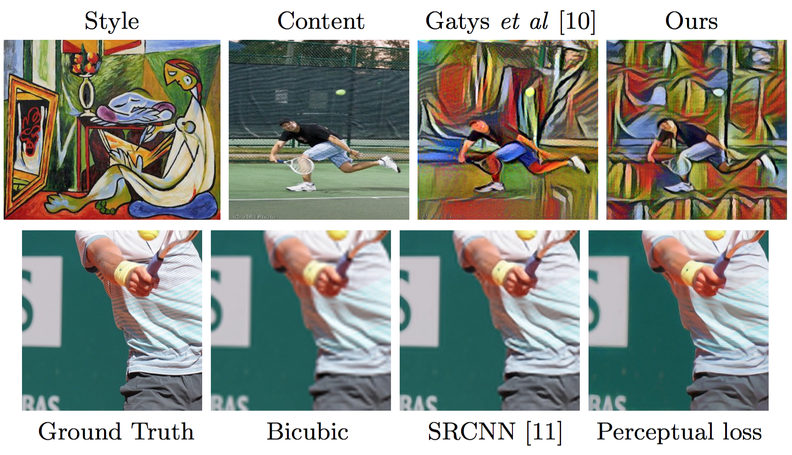
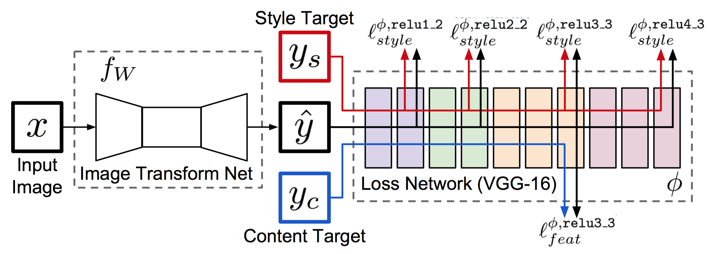
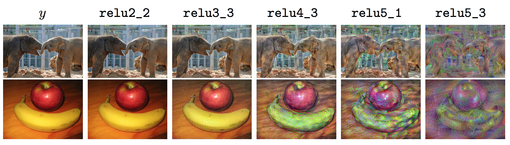
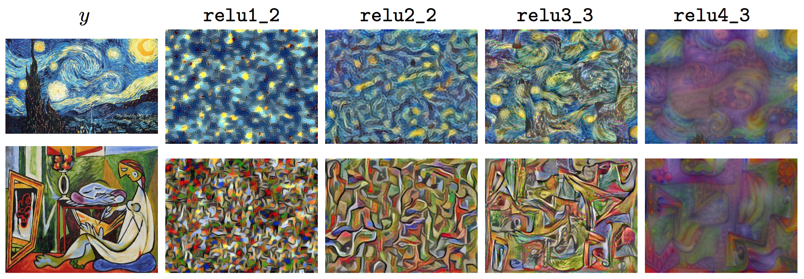
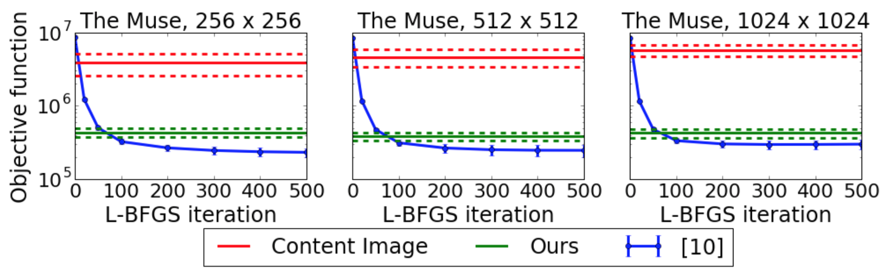
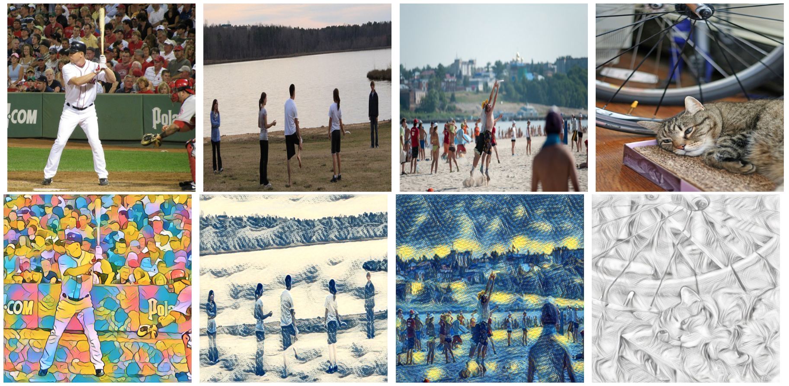
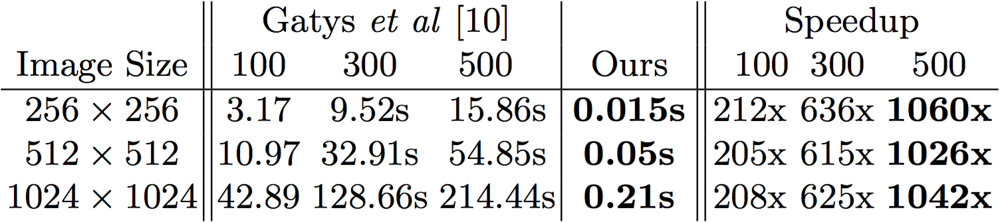
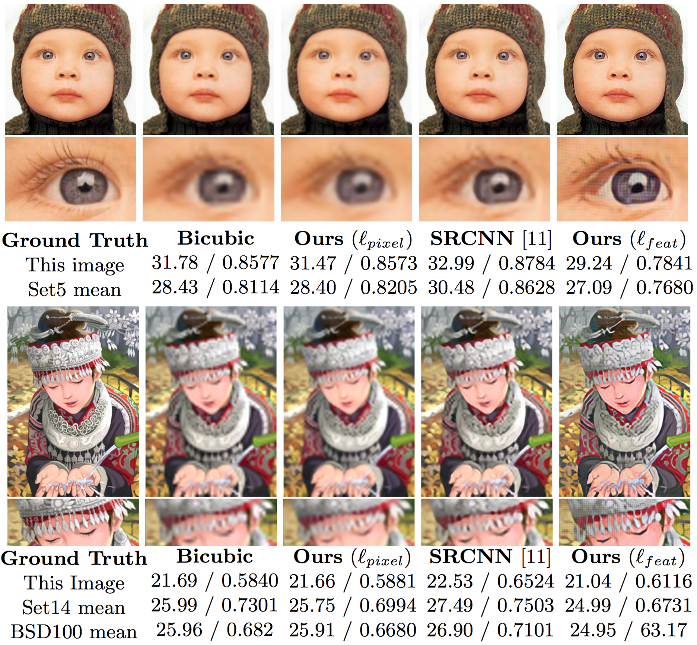
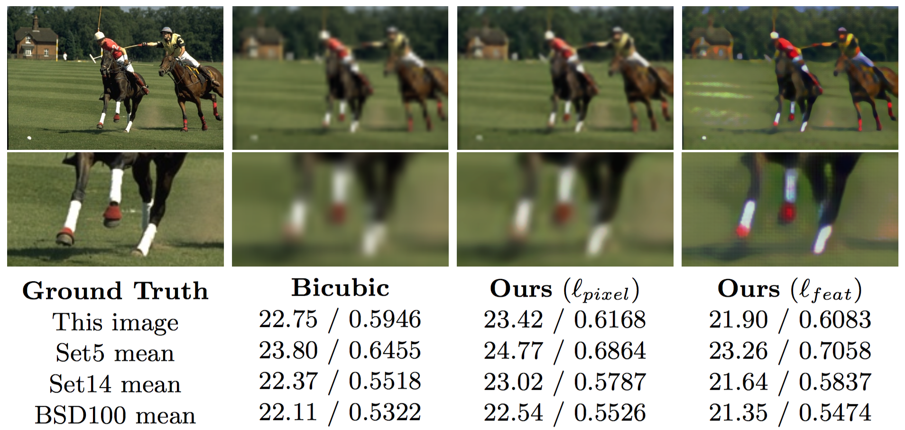

# Perceptual Losses for Real-Time Style Transfer and Super-Resolution

**感知损失在实时风格迁移和超分辨率中的应用**

Justin Johnson, Alexandre Alahi, Li Fei-Fei

{jcjohns, alahi, feifeili}@cs.stanford.edu

Department of Computer Science, Stanford University - 斯坦福大学计算机科学系

**摘要。**我们关心的图像变换问题，即输入图像被变换成输出图像。对于这种问题，最近的方法通常是使用在输出图像与真实图像之间的*逐像素*损失训练一个前馈卷积神经网络。同步的研究已经表明，可以通过基于从预训练网络提取的高级特征，定义和优化*感知*损失函数来生成高质量图像。我们结合这两种方法的优点，并提出使用感知损失函数来训练用于图像变换任务的前馈网络。我们展示了图像风格迁移的效果，其中前馈网络被训练以实时地解决由 Gatys 等人提出的优化问题。与基于优化的方法相比，我们的网络给出了类似的定性结果，但是快了三个数量级。我们还做了单图像超分辨率实验，其中用感知损失函数替换了逐像素损失，得出了视觉上令人满意的结果。

**关键词：** 风格迁移，超分辨率，深度学习

## 1. 介绍

许多经典问题可以被定义为*图像变换*任务，其中系统接收一些输入图像并将其变换成输出图像。图像处理的例子包括去噪，超分辨率和图像着色，其中输入是退化图像（高噪声，低分辨率或者是灰度图），然后输出是高质量的彩色图像。来自计算机视觉的示例包括语义分割和深度估计，其中输入是彩色图像，并且输出图像编码关于场景的语义或几何信息。

​	一种用于解决图像变换任务的方法是以监督的方式训练前馈卷积神经网络，使用逐像素损失函数来衡量输出图像和真实图像之间的差异。举个例子，这种方法由 Dong 等人用于超分辨率 [[1]](#1)，由 Cheng 等人用于着色 [[2]](#2)，由 Long 等人用于分割 [[3]](#3)，并且由 Eigen 等人用于深度和表面正常预测 [[4]](#4) [[5]](#5)。这些方法在测试时是很有效率的，只需要通过已训练网络的正向传递就可以做到。

​	然而，这些方法使用的逐像素损失不捕获输出图像与真实图像之间的*感知*差异。举个例子，两个相同的图像彼此偏移一个像素；尽管它们的感知非常相似，但是如果通过逐像素损失来测量的话，他们是非常不一样的。

**图 1.** 风格迁移 (第一列) 的和 $×4$ 超分辨率 (第二列) 的结果展示。对于风格迁移，我们可以在比 Gatys 等人快三个数量级的情况下取得相似的结果。对于超分辨率，与使用逐像素损失训练的方法比较，我们的使用感知损失训练的方法能比较好地重建精细细节。

​	同时，近来的工作已经表明，并行地，近来的工作已经表明，可以基于从预训练的卷积神经网络提取的高级图像特征之间的差异使用*感知损失函数*而不是像素之间的差异来生成高质量图片。通过将损失函数最小化来生成图片。这个策略已经应用在 Mahendran 等人的特征倒转 [[6]](#6)、Simonyan [[7]](#7) 和 Yosinski [[8]](#8) 等人的特征可视化还有 Gatys 等人的纹理合成和风格迁移 [[9]](#9) [[10]](#10)。这些方法可以产生高质量图片，但是很缓慢，因为还需要解决一些优化问题。

​	在这篇论文中我们结合了这两种方法的有优点。我们选择了训练一个前馈转换网络而不是使用只依赖低级别像素信息的逐像素损失函数来处理图像转换任务。我们使用基于从预训练网络中提取的高级别特征的感知损失函数来训练我们的网络。在训练过程中，感知损失在衡量图像相似性上比逐像素损失更精准确定，在测试时，转换网络能实时运行。

​	我们在两个任务上进行实验：风格迁移和单个图片超分辨率。两者都有内在的问题；对于风格迁移任务的问题是没有单个的正确输出，对于超分辨率任务的问题是有许多高分辨率图像可能产生相同的低分辨率输入。任一任务的成功都需要对输入图像的语义推理。对于风格迁移来说，输出图像必须在语义上与输入图像相似；对于超分辨率来说，精细细节必须从视觉上模糊的低分辨率输入推断出来。原则上，为任一任务训练的高容量神经网络可以隐式地学习推理相关语义；然而实际上我们不需要从头开始学习：感知损失函数将语义知识从损失网络传到变换网络。

​	对于风格迁移，我们的前馈网络训练用来解决从 [[10]](#10) 来的优化问题；我们的结果和 [[10]](#10) 在质上和目标函数值衡量来看都是相似的，但生成时快了三个数量级。对于超分辨，我们展示了用感知损失代替掉逐像素损失之后给出的视觉上愉悦的 4 倍的和 8 倍的超分辨率的结果。

## 2. 相关工作

**前馈图像转换。**近年来，通过训练具有逐像素损失函数的深卷积神经网络已经解决了各种各样的前馈图像变换任务。

​	语义分割方法 [[3]](#3)  [[5]](#5) [[12]](#12) [[13]](#13) [[14]](#14) [[15]](#15) 通过运行一个 逐像素分类损失训练出来的完全卷积网络在输入图像上产生密集的场景标签。[[15]](#15) 通过将 CRF 作为一个循环层与其他网络共同训练来超过逐像素损失。我们的转换网络的架构灵感来自 [[3]](#3) 和 [[14]](#14)，他们使用网络内降采样以减少特征映射的空间大小，随后是网络内升采样以产生最终输出图像。 

​	最近针对深度 [[5]](#5)[[4]](#4)[[16]](#16) 和表面正常预测 [[5]](#5) [[17]](#17) 的方法都是类似的，他们使用逐像素回归 [[4]](#4)[[5]](#5) 或者分类损失 [[17]](#17) 训练出来的前馈卷积网络来将一个彩色的输入图像转换成具有几何意义的输出图像。一些方法通过惩罚图像梯度 [[5]](#5) 或使用 CRF 损失层 [[16]](#16) 来强化输出图像中的局部一致性，从而摆脱逐像素损失。在 [[2]](#2) 中使用一个经逐像素损失训练出来的前馈模型来将灰度图像转换成彩色图像。

​	**感知优化。** 许多最近的论文已经使用优化来生成图像，其中目标是感知清晰的，这依赖于从卷积网络提取的高级特征。可以生成图片来使分类预测分数 [[7]](#7)[[8]](#8) 和个体特征 [[8]](#8) 最大化，以理解在以训练好的网络中编码的函数。相似的优化技术也被用来产生信任度高的虚假图片 [[18]](#18)[[19]](#19)。

​	Mahendran 和 Vedaldi [[6]](#6) 通过最小化特征重建损失来反演卷积网络中的特征，以便理解不同网络层保留的图像信息；类似的方法以前被用来反转本地二进制描述符 [[20]](#20) 和 HOG 特征 [[21]](#21)。

​	Dosovitskiy 和 Brox [[22]](#22) 的研究与我们特别相关，他们训练一个前馈神经网络反转卷积特征，快速逼近 [[6]](6) 提出的优化问题的解决方案。然而，他们的前馈网络是用逐像素重建损失来训练的，而我们的网络直接优化 [[6]](#6) 的特征重建损失。

​	**风格迁移。** Gatys 等人 [[10]](#10) 做的艺术风格迁移，通过共同最小化 [[6]](#6) 的特征重建损失和基于从预训练网络提取的特征的*风格重建损失*来将一个图像的*内容*和另一个图像的*风格*结合；一个相似的方法之前被用于纹理合成 [[9]](#9)。他们的方法虽然可以生成高质量的结果，但因为优化问题的每个步骤都需要前向和后向地通过整个预训练网络从而计算成本变得非常高。为了克服这个沉重的计算成本，我们训练一个前馈网络来快速地逼近他们的优化问题的结果。

**图 2.** 系统概览。我们训练了一个图像转换网络来将输入图像转换成输出图像。我们使用了一个为图像分类预训练的损失网络来定义感知损失函数，它可以衡量图像间内容和风格的感知差异。损失网络在训练的过程中保持不变。

​	**图像超分辨率。** 图像超分辨率是一个已经有了各种各样的技术的经典的问题。Yang 等人 [[23]](#23) 在广泛采用卷积神经网络之前提供了对普遍技术的详尽评价。他们将超分辨率技术分为基于预测的方法（双线性，双三次，Lanczos，[[24]](#24)），基于边缘的方法 [[25]](#25)[[26]](#26)，统计方法 [[27-33]](#27) 和稀疏字典方法 [[37]](#27) [[38]](#38)。不久前 [[1]](#1) 在单图像超分辨率问题上使用逐像素欧几里得损失训练的三层卷积神经网络完成了非凡的表现。其他的最先进的方法有 [[39]](#39)[[40]](#40)[[41]](#41)。

## 3. 方法

如同图2所示，我们的系统有两个组件：一个*图像转换网络*  $ f_W $ 和一个用来定义许多*损失函数* $ \ell_1,…,\ell_k $ 的*损失网络* $\phi$ 。图像转换网络是一个以权重 $W$ 为参数的深度残差卷积神经网络；他通过映射关系 $\hat{y} = f_W(x) $ 来将输入图像 $x$ 转换成输出图像 $\hat{y}$。每个损失函数计算出一个标量值 $\ell_i(\hat{y}, y_i)$ 来衡量输出图像 $\hat{y}$ 和*目标图像*  $y_i$ 之间的差距。使用随机梯度下降 (SGD) 来最小化损失函数的加权组合来训练图像转换网络。损失函数的加权组合：

$$ W^* ={\rm{arg}} \,\underset{W}{\rm{min}} \, {\bf{E}}_{x, \lbrace y_i \rbrace} \left[ \sum_{i=1} {\lambda_i \ell_i (f_W(x), y_i) } \right]           \tag{1} $$

​	为了解决逐像素损失的缺点，并让我们的损失函数更好地测量图像之间的感知和语义差异，我们从最近通过优化生成图像的工作 [[6-10]](#6) 中汲取灵感。这些方法的关键观点是：为图像分类而预训练过的卷积神经网络已经学会了编码出我们需要在损失函数里衡量的感知和语义信息。因此，我们利用一个已经预训练过用来图像分类的网络 $\phi$ 作为一个固定的*损失网络*，以便定义我们的损失函数。然后，我们的深度卷积转换网络使用也是深度卷积网络的损失函数进行训练。

​	损失网络 $\phi$ 是用来定义一个*特征重建损失* $\ell_{feat}^{\phi}$ 和一个*风格重建损失* $\ell_{style}^{\phi}$ 来衡量图像之间内容和风格的差异。对于每一个输入图像 $x$ 我们都有对应的一个*内容目标* $y_c$ 和一个*风格目标* $y_s$。对于风格迁移来说，内容目标 $y_c$ 是输入图像 $x$，输出图像 $\hat{y}$ 应该是输入的内容 $x=y_c$ 和特定的风格 $y_s$ 的结合；每种风格训练一个网络。对于单图像超分辨率来说，输入图像 $x$ 是低分辨率的，内容目标是 $y_c$ 是真实的高分辨率图像，在这里并没有用到风格重建损失；每个超分辨率因子训练一个网络。

### 3.1 图像转换网络

我们的图像转换网络大致遵循 Radford 等人提出的架构指南 [[42]](#42)。我们不使用任何的池化层，而是使用步长和极小步长卷积来进行网络中的降采样与升采样。我们的网络体包含了五个使用了 [[44]](#44) 架构的残差块 [[43]](#43)。除了输出层之外，所有的非残差卷积层都跟着空间批量规范化层和 ReLU 非线性层，而输出层是用了缩放的 tanh 确保输出图像具有 $[0, 255]$ 范围的像素。除了第一层和最后一层是使用 $9×9$ 的核之外，其他所有的卷积层都使用 $3×3$ 的核，我们全部网络的确切架构都可以在补充材料中找到。

**输入和输出。**对于风格迁移来说，输入和输出都是形状大小为 $3 × 256 × 256$ 的彩色图像。对于升采样因子为 $f$ 的超分辨率来说，输出是一个形状为 $3 × 288 × 288$ 的高分辨率图像，输入为 $3 × 288/f × 288/f $。由于图像转换网络是完全卷积的，在测试时他们可以应用到各种分辨率的图像上。

**降采样和升采样。**对于升采样因子为 $f$ 的超分辨率来说，我们使用几个残差块，随后是步长为 $1/2$ 的 $log_2 f$ 卷积层。这与 [[1]](#1) 中在将输入传到网络前使用双三次插值进行升采样和降低分辨不同。相比于依赖一个固定的升采样方法，极小步长卷积可以使升采样方法与网络的其他部分一起学习。

**图 3.** 与 [[6]](#6) 相似，我们使用了优化的方法在 VGG-16 损失网络 $\phi$ 中的好几层 $j$ 里去寻找一个能将特征重建损失 $\ell_{feat}^{\phi, j}(\hat{y}, y)$ 最小化的图像 $\hat{y}$。当我们从较高的层重建时，图像内容和整体空间结构得以保留，但颜色、纹理和精细的形状都不会保留。

​	对于风格迁移，我们的网络使用两个步长 2 卷积来对输入进行降采样，然后是几个残差块，然后是两个步长 1/2 的卷积层来进行升采样操作。虽然输入和输出有着同样的形状大小，但在网络中对他们进行降采样和升采样还是有几个优点的。

​	首先是计算上。通过简单的实现，一个 $3×3$ 大小的卷积配合 $C$ 个过滤器在输入大小为 $C × H × W$ 时要进行 $ 9HWC^2 $ 次乘加运算，和一个 $3×3$ 大小的卷积配合 $DC$ 个过滤器在输入大小为 $DC × H/D × W/D$ 时的计算代价一样。因为经过降采样，我们可以以相同的计算代价而使用更大的网络。

​	第二个优点是与有效感知域 (effective receptive field) 有关。高质量的风格迁移需要以连续的方式改变图像的很大的部分；因此对输出端的每一个像素在输入端都有一个很大的有效感知域是有利于上述要求的。如果没有进行降采样，每个额外的 $3×3$ 的卷积层都将有效感知域大小增加 $2$。当进行因子为 $D$ 的降采样之后，每个 $3×3$ 卷积层都将有效感知域大小增加 $2D$，从而在相同层数的情况下提供了更大的有效感知域。

**残差连接。** He 等人在 [[43]](#43) 中使用了*残差连接*来训练很深的网络来进行图像分类。他们认为残差连接能够使网络轻松地学习到辨别功能；这是图像转换网络中的一个吸睛属性，因为在大多数情况下输出图像应该与输入图像具有相同的结构。因此我们的网络体中包含了几个残差块，每个残差块包含了两个 $3×3$ 的卷积层。我们使用的是 [[44]](#44) 的残差块设计，在补充资料会有说明。

### 3.2 感知损失函数

我们定义了两个用来衡量图像间高级感知和语义差别的*感知损失函数*。他们使用对图像分类预训练的*损耗网络* $\phi$，这意味着这些感知损失函数本身就是深度卷积神经网络。在我们所有的实验中，$\phi$ 是一个在 ImageNet 数据集 [[47]](#47) 预训练好的 16 层 VGG 网络 [[46]](#46)。

**图 4.** 与 [[10]](#10) 类似，我们使用了优化的方法在 VGG-16 损失网络 $\phi$ 中的好几层 $j$ 里去寻找一个能将风格重建损失 $\ell_{style}^{\phi, j}(\hat{y}, y)$ 最小化的图像 $\hat{y}$。图像会保留它的风格特征，而不会保留形状结构。

**特征重建损失。** 与其说让输出图像 $\hat{y} = f_W(x)$ 的每一个像素都和目标图像 $y$ 一致，我们更倾向于让他们经过损失网络 $\phi$ 的计算后有比较相似的特征表现。让 $\phi_j(x)$ 表示处理图像 $x$ 时网络第 $j$ 层激活值；如果 $j$ 是一个卷积层那么 $\phi_j(x)$ 是形状大小为 $C_j × H_j × W_j$ 的特征图。*特征重建损失*是特征表现的(平方的，正则化的)欧几里得距离：

$$\ell_{feat}^{\phi, j}(\hat{y}, y) =\frac{1}{C_jH_jW_j}\|\phi_j(\hat{y}) - \phi_j(y)\|_2^2         \tag{2}$$

如 [[6]](#6) 中所示和 [图3](#image_3) 中所示，一个在靠前的层中使特征重建损失最小化的图像 $\hat{y}$ 会趋向于产生在视觉上与 $y$ 不可区分的图像。当我们从较高层重建时，图像内容和整体空间结构会保留下来，不过颜色、纹理和精细的形状就不会被保留。使用特征重建损失来训练我们的图像转换网络能让输出图像 $\hat{y}$ 在感知上与目标图像 $y$ 相似，但不会强制他们完全匹配。

**风格重建损失。** 当输出图像 $\hat{y}$ 在内容上偏离了目标图像 $y$ 时特征重建损失会对其进行修正。我们也希望能修正风格上的差异如颜色、纹理、常见的图案等。为了实现这个效果，Gatys 等人 [[9, 10]](#9) 提出了接下来要说的*风格重建损失*。

​	如上所述，让 $\phi_j(x)$ 表示输入是 $x$ 的网络 $\phi$ 第 $j$ 层的激活值，是一个形状为 $C_j × H_j × W_j$ 的特征图。定义 *Gram matrix* $G_j^\phi(x)$ 是一个 $C_j × C_j$ 的矩阵，他的元素是由下面的等式产生：

$$G_j^\phi(x)_{c,c^\prime} = \frac{1}{C_jH_jW_j}\sum_{h=1}^{H_j}\sum_{w=1}^{W_j}\phi_j(x)_{h,w,c}\phi_j(x)_{h,w,c^\prime}           \tag{3}$$

​	如果我们将 $\phi_j(x)$ 解释为在 $H_j × W_j$ 网格的每一个点的 $C_j$ 维特征，则 $G_j^\phi(x)$ 和 $C_j$ 维特征的非中心协方差成比例，把每个网格位置视为独立样本。因此它捕获到哪些特征是趋向于一起激活的。Gram 矩阵经过重排 $\phi_j(x)$ 到一个大小为 $C_j × H_jW_J$ 的矩阵 $\psi$ 后能更加高效地被计算；然后 $G_j^\phi(x) = \psi\psi^T/C_jH_jW_j$。

​	*风格重建损失*则是输出图像和目标图像的 Gram 矩阵的差距的平方 Frobenius 范数：

$$\ell_{style}^{\phi,j}(\hat{y},y) = \|G_j^\phi(\hat{y}) - G_j^\phi(y)\|_{F^.}^2                  \tag{4}$$

即使 $\hat{y}$ 和 $y$ 具有不一样的大小，风格重建损失也是能明确定义的，因为他们的 Gram 矩阵会有相同的形状。

​	如 [[10]](#10) 所示和 [图5](#image_5) 所示，生成一张最小化风格重建损失的图像 $\hat{y}$ 保留了目标图像的风格，但是损失了它的空间结构。从较高层重建能够从目标图像中转移更大的结构。

​	为了在层集 $J$ 中进行风格重建而不是在单个层 $j$ 中重建，我们定义 $\ell_{style}^{\phi,J}(\hat{y},y)$ 是每个层 $j \in J$ 的损失的总和。

### 3.3 简单损失函数

除了上面定义的两个感知损失函数之外，我们还定义了两个只依赖于低级像素信息的简单损失函数。

**像素损失。** *像素损失*是输出图像 $\hat{y}$ 和目标图像 $y$ 之间的(正则化的)欧几里得距离。如果两个都有相同的形状 $C×H×W$ 的话，那么他们的像素损失定义为 $\ell_{pixel}(\hat{y},y) = \|\hat{y} - y\|_2^2/CHW$。这只能用在存在一个真实数据目标 $y$ 让网络去匹配的情况。

**总偏差正则化(TV Regularization)。** 为了促进输出图像 $\hat{y}$ 的空间平滑度，我们遵循了先前就特征反演 [[6]](#6)[[20]](#20) 和超分辨率 [[48]](#48)[[49]](#49) 的研究，使用了*总偏差正则化* $\ell_{TV}(\hat{y})$。

## 4 实验

我们在两个图像转换任务上进行了实验：风格迁移和单图像超分辨率。在风格迁移上，先前的研究工作在生成图像上已经有做一定的优化；我们的前馈网络给出了类似的定性结果，但是在时间上快了三个数量级。在单图像超分辨率上，先前的方案是使用了逐像素损失的卷积神经网络；我们通过使用感知损失展现了鼓舞人心的结果。

### 4.1 风格迁移

​	风格迁移的目标是生成一张结合了*内容目标图像* $y_c$ 的内容和*风格目标图像* $y_s$ 的风格的图像 $\hat{y}$。我们为挑选的每种风格都训练了一个图像转换网络，然后拿生成的结果和 Gatys 等人 [[10]](#10) 的方法进行比较。

**图 5.** 我们的风格迁移网络和 [[10]](#10) 对同一个对象进行最小化。我们在 50 张图像上对比了他们的对象值；我们的网络虽然是使用 256 × 256 的图像训练，但能扩用在更大的图像上。

**基准。** 作为基准，我们重新实现了 Gatys 等人 [[10]](#10) 的方法。给出风格目标 $y_s$、内容目标$y_c$、特征重建层 $j$ 和风格重建层 $J$，然后图像 $\hat{y}$ 可以通过解决下面的问题产生：

$$\hat{y} ={ \rm{arg}} \,\underset{y}{\rm{min}} \lambda_c \ell_{feat}^{\phi,j}(y,y_c) + \lambda_s \ell_{style}^{\phi,J}(y,y_s) + \lambda_{TV} \ell_{TV}(y)        \tag{5}$$

其中 $\lambda_c$、$\lambda_s$ 和 $\lambda_{TV}$ 是标量值，$y$ 用白噪音初始化，然后用 L-BFGS 优化。我们发现，等式 $5$ 的无约束优化通常会导致结果图像的像素超出 $[0,255]$ 这个边界。我们将我们的方法产生的结果约束到这个范围之后，为了能更公平地比较，对于基线，我们使用投影的 L-BFGS，通过在每个迭代中将图像 $y$ 缩减到范围 $[0,255]$ 来最小化等式 $5$。在大多数情况下，500 次迭代中优化收敛到令人满意的结果。这个方法慢的原因是每个 L-BFGS 迭代都要向前向后遍历一遍 VGG-16 损失网络。

**训练细节。**我们的风格迁移网络在微软 COCO 数据集 [[50]](#50) 上训练。我们将 8 万张训练图像的尺寸调整到 256 × 256 然后以批次大小为 4 循环 40,000 次来训练我们的网络，粗略地将训练数据跑了两次。我们使用学习速率为 $1 × 10^{-3}$ 的 Adam 优化器进行优化。输出图像通过总偏差正则化进行正则化，强度在 $1 × 10^{-6}$ 和 $1 × 10^{-4}$ 之间，依据每种风格目标的交叉验证来选择合适的强度。因为模型不会在两次训练中就发生过拟合，我们不使用权重衰变和临时默点 (dropout)。在所有的风格迁移实验中，我们在 VGG-16 损失网络 $\phi$ 中的 $\tt{relu2\_2}$ 层中进行特征重建，在 $\tt{relu1\_2}$、$\tt{relu2\_2}$、$\tt{relu3\_3}$ 和 $\tt{relu4\_3}$ 层中进行风格重建。我们的实验是用 Torch 和 cuDNN 实现，在一个 GTX Titan X 的 GPU 上跑的训练耗时大概 4 小时。

**定性结果。** 在 [图6](#image_6) 中展示了我们的结果和基准方法在各种风格和内容的图像上进行比较的定性示例。在所有情况下，超参数 $\lambda_c$、$\lambda_s$ 和 $\lambda_{TV}$ 在这两种方法之间都是相同的；所有的内容图像都是取自 MS-COCO 2014 验证集。总体而言，我们的结果在质量上与基准方法相似。

​	虽然我们的方法是用 $256 × 256$ 的图像训练而得，但在测试时，它也可以以完全卷积的方式应用于任意大小的图像。在 [图7](#image_7) 中我们展示了 $512 × 512$ 的图像用我们的模型进行风格迁移的结果。

**图 6.** 使用我们的风格迁移网络的结果展示。我们的结果在质的方面与 Gatys 等人的相似，但在生成上快了不少 (看 [表格 1](#table_1))。所有生成的图像都是 256 × 256 像素。

**图 7.** 风格迁移在 512 × 512 图像上的结果展示。测试时模型是以全卷积的方式应用在高像素图像上，风格图像与 [图6](#image_6) 中展示的一致

​	这些结果显然可知，训练毕的风格迁移网络能够意识到图像中的语义内容。比如在 [图7](#image_7) 中的海滩那张图，人在转换后的图像中仍然能被清晰地识别，而背景则变化到无法辨认；相似地，在转换过的猫的图中，猫的脸清晰可见，但它的身体却不行。有一个解释是：VGG-16 损失网络对人和动物有一定的选择性特征，因为这些事物在 VGG-16 训练的分类数据集中有展现到。我们的风格迁移网络是训练用来反演 VGG-16 特征的，所以它在反演人和动物方面比反演背景学的更多。

**定量结果。** 基准方法和我们的方法都是在将等式 $5$ 最小化。基准方法对输出图像进行显式的优化，我们的方法是训练以一次传播就找到任意内容图像 $y_c$ 的答案。因此，我们可以通过衡量他们能否成功地最小化等式 $5$ 的程度来定量地比较这两种方法。

​	我们在从 MS-COCO 验证集中提取的 50 张图像上分别使用我们的方法和基准方法跑了一遍，使用的风格图像是巴勃罗·毕加索作的*缪斯 (The Muse)*。对于基准方法，我们记录了优化的每一次迭代中目标函数的值，对于我们的方法，我们记录了每张图像的在等式 $5$ 中的值；我们还计算了在 $y$ 等于内容图像 $y_c$ 时等式 $5$ 的值。结果在 [图5](#image_5) 中展示。我们看到内容图像 $y_c$ 达到了很高的损失，我们的方法达到了相当于在 $50$ 到 $100$ 次迭代的显式优化的损失。

​	虽然我们的网络是训练在 $256 × 256$ 的图像中最小化等式 $5$，但它应用在较大图像中时也能成功地将目标最小化。我们分别在 $512 × 512$ 和 $1024 × 1024$ 尺寸下对 $50$ 张图像进行相同的量化评估。评估结果展示在 [图5](#image_5)。我们可以看到，即使在更高像素的条件下，我们的模型仍然达到了相当于在 $50$ 到 $100$ 次迭代的基准方法的损失。

**表格 1。** 我们的风格迁移网络与基于优化的基准方法在不同迭代次数和不同图像分辨率中速度 (秒级) 的比较。我们的方法给出了相似的定性结果 (可以在 [图6](#image_6) 看到) 但比基准方法的一步优化步骤还要快。这两种方法都是在一块 GTX Titan X GPU 上进行检测。</sapn>

**速度。** 在表格1中我们比较了我们的方法与基准方法在几种不同的图像大小上的运行时间；对于基准方法，我们记录了不同次数的优化迭代所需的时间。在测试的所有图像大小中，我们看到我们的方法的运行时间大约是基准方法迭代一次的时间的一半。与基准方法迭代 500 次相比，我们的方法快了三个数量级。我们的方法在处理 $512 × 512$ 大小的图像时能达到 20 FPS，这意味着可以做到在视频上实时进行风格迁移。

### 4.2 单图像超分辨率

单图像超分辨率的目的是依据一个低像素输入图像生成一个高像素的输出图像。这是一个固有不足的问题，因为对于每个低分辨率图像，可能存在许多个可以产生它的高分辨率图像。随着超分辨率因子的增大，这种歧义性会变得更大。在大因子比如 $(×4,×8)$ 的情况中，高分辨率图像的一些细节在其低分辨率图像中可能只有很小或者没有痕迹。

​	为了解决这个问题，我们不用常见的逐像素损失 [[1]](#1) 来训练超分辨率网络，而是使用一个特征重建损失 (在第 3 节可以看到) 以允许将语义知识从预训练的损失网络传到超分辨率网络。因为在更大的因子的情况下需要对输入进行更多的语义推理，所以我们把焦点主要放在超分辨率是 $×4$ 和 $× 8$ 的实验上。

​	用于评估超分辨率的传统指标是 PSNR 和 SSIM [[54]](#54)，人们发现这两种都与人类视觉评估的相关性很差 [[55,56,57,58,59]](#55)。PSNR 和 SSIM 只依赖于低级的像素间差异然后在加性高斯噪声的作用下进行操作，这可能对于超分辨率并没有用。此外，PSNR 相当于逐像素损耗 $\ell_{pixel}$，因此如果使用 PSNR 衡量结果优劣，通过最小化逐像素损耗训练的模型应始终优于通过最小化特征重建损耗训练的模型。因此我们强调我们实验的目的并不是实现最先进的在 PSNR 或 SSIM 上衡量的结果，而是展示逐像素损失训练的模型和特征重建损失训练的模型在性质上的差异。

**图 8.** 在 Set5 (第一列) 和 Set14 (第二列) 中取的图像的 $×4$ 超分辨率结果展示。我们记录了每个例子的 PSNR / SSIM 值和他们在数据集中的平均值。更多的结果可以在附加材料中查阅。

**模型细节。** 我们在 VGG-16 损失网络 $\phi$ 中的 $\tt{relu2\_2}$ 层最小化特征重建损失来训练因子为 $×4$ 和 $×8$ 的超分辨率模型。我们使用 1 万张从 MS-COCO 训练集中提取的图像，尺寸是 $288 × 288$，然后通过使用宽度为 $\sigma = 1.0$ 的高斯核对图像进行模糊处理，然后再使用双三次插值法对其进行降采样，以得到低分辨率的输入。我们训练使用 Adam 优化器 [[51]](#51)，学习率为 $1×10^{-3}$，不使用权重衰变和临时默点 (dropout)，以 4 的批次大小进行 20 万次迭代。作为后续处理步骤，我们做了我们的网络输出与低像素输入的直方图比较。

**基准。** 我们使用目前具有最出色表现的 SRCNN [[1]](#1) 作为基准模型。SRCNN 是一个三层卷积网络，训练以最小化取自 ILSVRC 2013 检测数据集中的 $33×33$ 大小的图像的逐像素损失。SRCNN 并不是训练给因子是 $×8$ 的超分辨率的，所有我们只能在因子为 $×4$ 的情况下进行评估。

​	SRCNN 经过多于 $10^9$ 次迭代的训练，这在我们的模型上是无法做到的。为了说明 SRCNN 与我们的模型在数据、训练和结构上的差异，我们使用 $\ell_{pixel}$ 训练因子为 $×4$ 和 $×8$ 的超分辨率图像转换网络；这些网络和最小化 $\ell_{feat}$ 训练的网络使用的是一样的数据、结构和训练过程。

**评估。** 我们在 标准集 Set5 [[60]](#60)、Set14 [[61]](#61) 和 BSD100 [[41]](41) 数据集上对所有模型进行评估。我们所报告的 PSNR 和 SSIM [[54]](#54) 都是转换到 YCbCr 色彩空间之后只对 Y 通道进行计算，像 [[1]](#1)[[39]](#39) 一样。

**结果。** 我们在 [图8](#image_8) 展示了 $×4$ 的超分辨率结果。与其他模型对比，我们使用特征重建的模型在重建锐利边界和精细细节上的重建做的很棒，比如在第一张图像中的睫毛，和第二张图中的帽子上不同的细小部件。特征重建损失导致在图像放大时有可见的轻微的交叉影线图案，与基准方法相比，这会导致它的 PSNR 和 SSIM 值不佳。

​	在 [图9](#image_9) 展示了 $×8$ 的超分辨率结果。我们再一次看到我们使用 $\ell_{feat}$ 的模型在边界和精细细节上的处理比其他模型要好，比如马的腿部和蹄子。使用 $\ell_{feat}$ 的模型并不盲目地锐化边界；对比与使用 $\ell_{pixel}$ 的模型，使用 $\ell_{feat}$ 的模型锐化了马和骑手的边界，但是背景的树林仍然是模糊的。表明使用 $\ell_{feat}$ 的模型可能更专注于图像的语义信息。

​	因为我们使用 $\ell_{pixel}$ 的模型和使用 $\ell_{feat}$ 的模型使用的是同样的结构、数据和训练过程，所以它们所有的差异都是因为 $\ell_{pixel}$ 和 $\ell_{feat}$ 的不同而导致的。$\ell_{pixel}$ 损失能给出更高的 PSNR 值但是视觉效果很差，而 $\ell_{feat}$ 在重建精细细节上做得更好，也因为这样，就有了比较好的视觉效果。

**图 9.** BSD100 数据集中的一张图像在缩放因子是 $×8$ 的超分辨的结果。我们记录了 PSNR / SSIM 值和他们在数据集中的平均值。更多的结果可以在附加材料中查阅。

## 5 总结

在这篇论文中，我们结合了前馈图像转换任务和基于优化的方法的优点，在图像生成上，使用感知损失函数训练一个前馈转换网络。我们再风格迁移上应用了这个方法，相比原有方法我们实现了难分伯仲的效果和速度上的巨大提升，在单图像超分辨率上我们展示了使用感知损失训练的模型可以更好的重建精细细节和边界。

​	在未来的研究工作中我们希望尝试将感知损失函数用于其他的图像转换任务上，比如图像着色和语义分割。我们还计划考察不同的损失网络的使用，看看在不同任务或者不同的数据集上训练的损失网络是否能给图像转换网络带来不同类型的语义信息。

## 引用

 1. Dong, C., Loy, C.C., He, K., Tang, X.: Image super-resolution using deep convolutional networks. (2015) 

 2. Cheng, Z., Yang, Q., Sheng, B.: Deep colorization. In: Proceedings of the IEEE International Conference on Computer Vision. (2015) 415–423 

 3. Long, J., Shelhamer, E., Darrell, T.: Fully convolutional networks for semantic segmentation. CVPR (2015) 

 4. Eigen, D., Puhrsch, C., Fergus, R.: Depth map prediction from a single image using a multi-scale deep network. In: Advances in Neural Information Processing Systems. (2014) 2366–2374 

 5. Eigen, D., Fergus, R.: Predicting depth, surface normals and semantic labels with a common multi-scale convolutional architecture. In: Proceedings of the IEEE International Conference on Computer Vision. (2015) 2650–2658 

 6. Mahendran, A., Vedaldi, A.: Understanding deep image representations by inverting them. In: Proceedings of the IEEE Conf. on Computer Vision and Pattern Recognition (CVPR). (2015) 

 7. Simonyan, K., Vedaldi, A., Zisserman, A.: Deep inside convolutional networks: Visualising image classification models and saliency maps. arXiv preprint arXiv:1312.6034 (2013) 

 8. Yosinski, J., Clune, J., Nguyen, A., Fuchs, T., Lipson, H.: Understanding neural networks through deep visualization. arXiv preprint arXiv:1506.06579 (2015) 

 9. Gatys, L.A., Ecker, A.S., Bethge, M.: Texture synthesis using convolutional neural networks. In: Advances in Neural Information Processing Systems 28. (May 2015) 

 10. Gatys, L.A., Ecker, A.S., Bethge, M.: A neural algorithm of artistic style. arXiv preprint arXiv:1508.06576 (2015) 

 11. Dong, C., Loy, C.C., He, K., Tang, X.: Learning a deep convolutional network for image super-resolution. In: Computer Vision–ECCV 2014. Springer (2014) 184–199 

 12. Farabet, C., Couprie, C., Najman, L., LeCun, Y.: Learning hierarchical features for scene labeling. Pattern Analysis and Machine Intelligence, IEEE Transactions on 35(8) (2013) 1915–1929 

 13. Pinheiro, P.H., Collobert, R.: Recurrent convolutional neural networks for scene parsing. arXiv preprint arXiv:1306.2795 (2013) 

 14. Noh, H., Hong, S., Han, B.: Learning deconvolution network for semantic segmentation. arXiv preprint arXiv:1505.04366 (2015) 

 15. Zheng, S., Jayasumana, S., Romera-Paredes, B., Vineet, V., Su, Z., Du, D., Huang, C., Torr, P.H.: Conditional random fields as recurrent neural networks. In: Proceedings of the IEEE International Conference on Computer Vision. (2015) 1529–1537 

 16. Liu, F., Shen, C., Lin, G.: Deep convolutional neural fields for depth estimation from a single image. In: Proceedings of the IEEE Conference on Computer Vision and Pattern Recognition. (2015) 5162–5170 

 17. Wang, X., Fouhey, D., Gupta, A.: Designing deep networks for surface normal estimation. In: Proceedings of the IEEE Conference on Computer Vision and Pattern Recognition. (2015) 539–547 

 18. Szegedy, C., Zaremba, W., Sutskever, I., Bruna, J., Erhan, D., Goodfellow, I., Fergus, R.: Intriguing properties of neural networks. arXiv preprint arXiv:1312.6199 (2013) 

 19. Nguyen, A., Yosinski, J., Clune, J.: Deep neural networks are easily fooled: High confidence predictions for unrecognizable images. In: Computer Vision and Pattern Recognition (CVPR), 2015 IEEE Conference on, IEEE (2015) 427–436 

 20. d’Angelo, E., Alahi, A., Vandergheynst, P.: Beyond bits: Reconstructing images from local binary descriptors. In: Pattern Recognition (ICPR), 2012 21st International Conference on, IEEE (2012) 935–938 

 21. Vondrick, C., Khosla, A., Malisiewicz, T., Torralba, A.: Hoggles: Visualizing object detection features. In: Proceedings of the IEEE International Conference on Computer Vision. (2013) 1–8 

 22. Dosovitskiy, A., Brox, T.: Inverting visual representations with convolutional networks. arXiv preprint arXiv:1506.02753 (2015) 

 23. Yang, C.Y., Ma, C., Yang, M.H.: Single-image super-resolution: a benchmark. In: Computer Vision–ECCV 2014. Springer (2014) 372–386 

 24. Irani, M., Peleg, S.: Improving resolution by image registration. CVGIP: Graphical models and image processing 53(3) (1991) 231–239 

 25. Freedman, G., Fattal, R.: Image and video upscaling from local self-examples. ACM Transactions on Graphics (TOG) 30(2) (2011) 12 

 26. Sun, J., Sun, J., Xu, Z., Shum, H.Y.: Image super-resolution using gradient profile prior. In: Computer Vision and Pattern Recognition, 2008. CVPR 2008. IEEE Conference on, IEEE (2008) 1–8 

 27. Shan, Q., Li, Z., Jia, J., Tang, C.K.: Fast image/video upsampling. In: ACM Transactions on Graphics (TOG). Volume 27., ACM (2008) 153 

 28. Kim, K.I., Kwon, Y.: Single-image super-resolution using sparse regression and natural image prior. Pattern Analysis and Machine Intelligence, IEEE Transactions on 32(6) (2010) 1127–1133 

 29. Xiong, Z., Sun, X., Wu, F.: Robust web image/video super-resolution. Image Processing, IEEE Transactions on 19(8) (2010) 2017–2028 

 30. Freeman, W.T., Jones, T.R., Pasztor, E.C.: Example-based super-resolution. Computer Graphics and Applications, IEEE 22(2) (2002) 56–65 

 31. Chang, H., Yeung, D.Y., Xiong, Y.: Super-resolution through neighbor embedding. In: Computer Vision and Pattern Recognition, 2004. CVPR 2004. Proceedings of the 2004 IEEE Computer Society Conference on. Volume 1., IEEE (2004) I–I 

 32. Glasner, D., Bagon, S., Irani, M.: Super-resolution from a single image. In: Computer Vision, 2009 IEEE 12th International Conference on, IEEE (2009) 349–356 

 33. Yang, J., Lin, Z., Cohen, S.: Fast image super-resolution based on in-place example regression. In: Proceedings of the IEEE Conference on Computer Vision and Pattern Recognition. (2013) 1059–1066 

 34. Sun, J., Zheng, N.N., Tao, H., Shum, H.Y.: Image hallucination with primal sketch priors. In: Computer Vision and Pattern Recognition, 2003. Proceedings. 2003 IEEE Computer Society Conference on. Volume 2., IEEE (2003) II–729 

 35. Ni, K.S., Nguyen, T.Q.: Image superresolution using support vector regression. Image Processing, IEEE Transactions on 16(6) (2007) 1596–1610 

 36. He, L., Qi, H., Zaretzki, R.: Beta process joint dictionary learning for coupled feature spaces with application to single image super-resolution. In: Proceedings of the IEEE Conference on Computer Vision and Pattern Recognition. (2013) 345–352 

 37. Yang, J., Wright, J., Huang, T., Ma, Y.: Image super-resolution as sparse representation of raw image patches. In: Computer Vision and Pattern Recognition, 2008. CVPR 2008. IEEE Conference on, IEEE (2008) 1–8 

 38. Yang, J., Wright, J., Huang, T.S., Ma, Y.: Image super-resolution via sparse representation. Image Processing, IEEE Transactions on 19(11) (2010) 2861–2873 

 39. Timofte, R., De Smet, V., Van Gool, L.: A+: Adjusted anchored neighborhood regression for fast super-resolution. In: Computer Vision–ACCV 2014. Springer (2014) 111–126 

 40. Schulter, S., Leistner, C., Bischof, H.: Fast and accurate image upscaling with super-resolution forests. In: Proceedings of the IEEE Conference on Computer Vision and Pattern Recognition. (2015) 3791–3799 

 41. Huang, J.B., Singh, A., Ahuja, N.: Single image super-resolution from transformed self-exemplars. In: Computer Vision and Pattern Recognition (CVPR), 2015 IEEE Conference on, IEEE (2015) 5197–5206 

 42. Radford, A., Metz, L., Chintala, S.: Unsupervised representation learning with deep convolutional generative adversarial networks. arXiv preprint arXiv:1511.06434 (2015) 

 43. He, K., Zhang, X., Ren, S., Sun, J.: Deep residual learning for image recognition. arXiv preprint arXiv:1512.03385 (2015) 

 44. Gross, S., Wilber, M.: Training and investigating residual nets. http://torch.ch/blog/2016/02/04/resnets.html (2016) 

 45. Ioffe, S., Szegedy, C.: Batch normalization: Accelerating deep network training by reducing internal covariate shift. In: Proceedings of The 32nd International Conference on Machine Learning. (2015) 448–456 

 46. Simonyan, K., Zisserman, A.: Very deep convolutional networks for large-scale image recognition. arXiv preprint arXiv:1409.1556 (2014) 

 47. Russakovsky, O., Deng, J., Su, H., Krause, J., Satheesh, S., Ma, S., Huang, Z., Karpathy, A., Khosla, A., Bernstein, M., Berg, A.C., Fei-Fei, L.: ImageNet Large Scale Visual Recognition Challenge. International Journal of Computer Vision (IJCV) 115(3) (2015) 211–252 

 48. Aly, H.A., Dubois, E.: Image up-sampling using total-variation regularization with a new observation model. Image Processing, IEEE Transactions on 14(10) (2005) 1647–1659 

 49. Zhang, H., Yang, J., Zhang, Y., Huang, T.S.: Non-local kernel regression for image and video restoration. In: Computer Vision–ECCV 2010. Springer (2010) 566–579 

 50. Lin, T.Y., Maire, M., Belongie, S., Hays, J., Perona, P., Ramanan, D., Dolla ́r, P., Zitnick, C.L.: Microsoft coco: Common objects in context. In: Computer Vision–ECCV 2014. Springer (2014) 740–755 

 51. Kingma, D., Ba, J.: Adam: A method for stochastic optimization. arXiv preprint arXiv:1412.6980 (2014) 

 52. Collobert, R., Kavukcuoglu, K., Farabet, C.: Torch7: A matlab-like environment for machine learning. In: BigLearn, NIPS Workshop. Number EPFL-CONF-192376 (2011) 

 53. Chetlur, S., Woolley, C., Vandermersch, P., Cohen, J., Tran, J., Catanzaro, B., Shelhamer, E.: cudnn: E cient primitives for deep learning. arXiv preprint arXiv:1410.0759 (2014) 

 54. Wang, Z., Bovik, A.C., Sheikh, H.R., Simoncelli, E.P.: Image quality assessment:from error visibility to structural similarity. Image Processing, IEEE Transactions on 13(4) (2004) 600–612 

 55. Hanhart, P., Korshunov, P., Ebrahimi, T.: Benchmarking of quality metrics on ultra-high definition video sequences. In: Digital Signal Processing (DSP), 2013 18th International Conference on, IEEE (2013) 1–8 

 56. Wang, Z., Bovik, A.C.: Mean squared error: love it or leave it? a new look at signal fidelity measures. Signal Processing Magazine, IEEE 26(1) (2009) 98–117 

 57. Huynh-Thu, Q., Ghanbari, M.: Scope of validity of psnr in image/video quality assessment. Electronics letters 44(13) (2008) 800–801 

 58. Sheikh, H.R., Sabir, M.F., Bovik, A.C.: A statistical evaluation of recent full reference image quality assessment algorithms. Image Processing, IEEE Transactions on 15(11) (2006) 3440–3451 

 59. Kundu, D., Evans, B.L.: Full-reference visual quality assessment for synthetic images: A subjective study. Proc. IEEE Int. Conf. on Image Processing (2015) 

 60. Bevilacqua, M., Roumy, A., Guillemot, C., Alberi-Morel, M.L.: Low-complexity single-image super-resolution based on nonnegative neighbor embedding. (2012) 

 61. Zeyde, R., Elad, M., Protter, M.: On single image scale-up using sparse-representations. In: Curves and Surfaces. Springer (2010) 711–730 